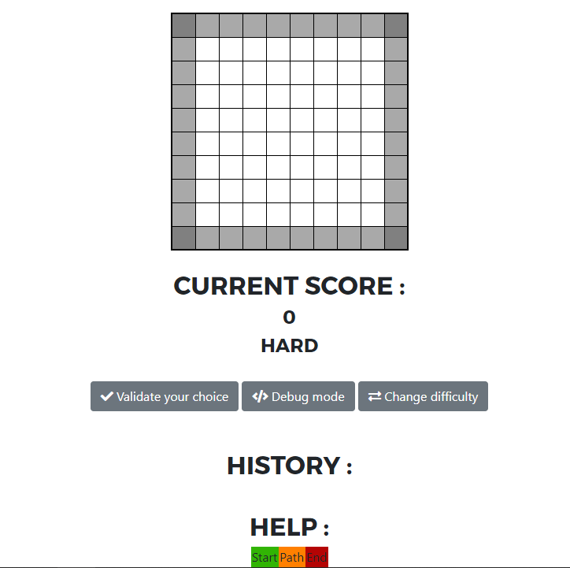

# Atoms

 

Five balls (atoms) are secretly placed on a checkerboard of 8 × 8 boxes. We do not see these balls on the board, the goal of the player is to find out where these balls are in as few shots as possible.

Made for the Web programming (client side) course at the Bordeaux Institude of Technology (grade: 19/20).

## 1. Getting started
### 1.1 Prerequisites
A web browser.

### 1.2 How to use it
Go to my [website](https://n3roo.github.io/projects/atoms.html#content), there is everything you need: the **rules** & the **game**.

### 1.3 Setting up your dev environment
Open you favorite web IDE, and edit box.js.

## 2. Miscellaneous
### 2.1 Changelog
The changelog is available [here](CHANGELOG.md).

### 2.2 Authors
- **N3ROO** - *Initial work* - [Github](https://github.com/N3ROO) [Website](https://n3roo.github.io/)

### 2.3 License
This project is licensed under the GPL-3.0 license - see the [LICENSE.md](LICENSE.md) file for details